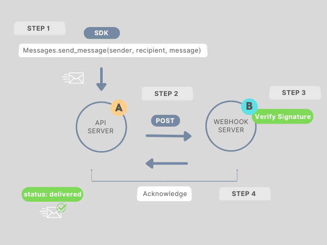

# SDK Implementation for Sinch

This project is an SDK implementation created for Sinch's Developer Experience assessment. The goal was to create a developer-friendly Python library to interact with the Sinch API, keeping developer experience at the forefront while addressing core functionality, security, and usability.

---

## Features

- **Contacts Management**: Create, update, retrieve, and delete contact information.
- **Test Coverage**: Unit and integration tests to ensure functionality.
- **Authentication Management**: Automatically manage and include authentication headers for all requests.
- **Developer-Friendly Design**: Autocompletion-friendly methods to discover API parameters and methods.
- **Error Handling**:  Extensive Logging for reliable debugging.
- **Messaging**: Send and retrieve messages securely (with Webhook).
- **Bonus Task: Webhooks**: Process webhook events with signature verification for secure communication.

---

## Getting Started

### Installation

1. Clone the repository:
   ```bash
   git clone https://github.com/kkemizinha/devexp-assessment.git
   cd devexp-hw
   ```

2. Install dependencies:
   ```bash
   pip install -r requirements.txt
   ```

3. Set up the environment:
   ```bash
   export PYTHONPATH=YOUR_PATH/devexp-assessment:$PYTHONPATH
   ```

---

## SDK Usage

**SDK Documentation**: `docs/html`

**Examples on how to use it**: 
1. Create, Update, List, and Delete contacts:
```python
export PYTHONPATH=YOUR_PATH/devexp-assessment:$PYTHONPATH
python examples/run_example_contacts.py
```

2. Create two contacts, Send a message, and manage the webhook event (Bonus Task):
```python
export PYTHONPATH=YOUR_PATH/devexp-assessment:$PYTHONPATH
python examples/run_example_send_message_webhook.py
```

Some examples:
1. Create a contact:
```python
from sdk.api_client import APIClient
from sdk.resources.contacts import Contacts
from sdk.resources.messages import Messages

# Initialize the client
client = APIClient(config_path="sdk/config.yaml")
contacts = Contacts(client)
messages = Messages(client)

# Create a contact
alice = contacts.create_contact(name="Alice", phone="+14155552671")
bob = contacts.create_contact(name="Bob", phone="+34612345678")
```

#### **2. Send a Message**
```python
# Send a message
response = messages.send_message(
    sender_phone = alice["phone"],
    recipient_id = bob["id"],
    content="Hello, Bob! How are you?"
)
print(f"Message sent: {response}")
```

#### **3. List All Contacts**
```python
# List contacts
all_contacts = contacts.list_contacts()
print(f"All contacts: {all_contacts}")
```

---


## Bonus Task: Webhook Implementation

A webhook server was implemented to meet the bonus task requirements. 
The webhook server processes the API server notification by verifying the HMAC signature in the `Authorization` header and printing the event data.

### Webhook Server Key Features

- **HMAC Signature Validation**: The `verify_signature` method in the SDK acknowledge messages.
- **Event Handling**: Processes incoming webhook events and prints them to Docker Logs on the console.
- **Integration with SDK**: Demonstrates SDK functionality for validating and managing webhook events.

### Workflow Between SDK, API Server, and Webhook Server



 **Step 1. SDK Sends Request to API Server**  
   - The developer uses the SDK to interact with the API (e.g., sending messages and creating contacts).  
   - SDK handles authentication and constructs HTTP requests.

 **Step 2. API Server Processes Request and Sends a Request**  
   - Verifies the request and acts (e.g., queues messages).  
   - For messages, the server queues them and returns an initial status (`queued`).
   - Sends a POST request to the Webhook Server with message details and an HMAC signature for verification.

**Step 3. Webhook Server Validates Event**  
   - Verifies the HMAC signature using the SDK's `verify_signature` method.  
   - Responds with HTTP 200 (success) or 401 (failure).

**Step 4. API Server Updates Message Status**  
   - If Webhook Server acknowledges: Updates status to `delivered`.  
   - If it fails or is not acknowledged, update the status to `failed.`

---

## Testing

### How Testing Was Addressed:

- **Unit Tests**: Focused on individual SDK components to ensure methods behave correctly.
- **Integration Tests**: Validated end-to-end functionality with live API calls.

### Running Tests:

1. Run Unit Tests:
   ```bash
   export PYTHONPATH=YOUR_PATH/devexp-assessment:$PYTHONPATH
   python -m unittest discover -s tests/unit
   ```

2. Run Integration Tests:
   ```bash
   export PYTHONPATH=YOUR_PATH/devexp-assessment:$PYTHONPATH
   python -m unittest discover -s tests/integration
   ```

---

## Improvements & Future Work

- Enhance logging and error reporting to provide actionable insights.
- Expand SDK to support additional API methods and Sinch services.
- Improve edge-case handling in tests for increased robustness.
- Create detailed documentation for the webhook server and SDK features.

---
